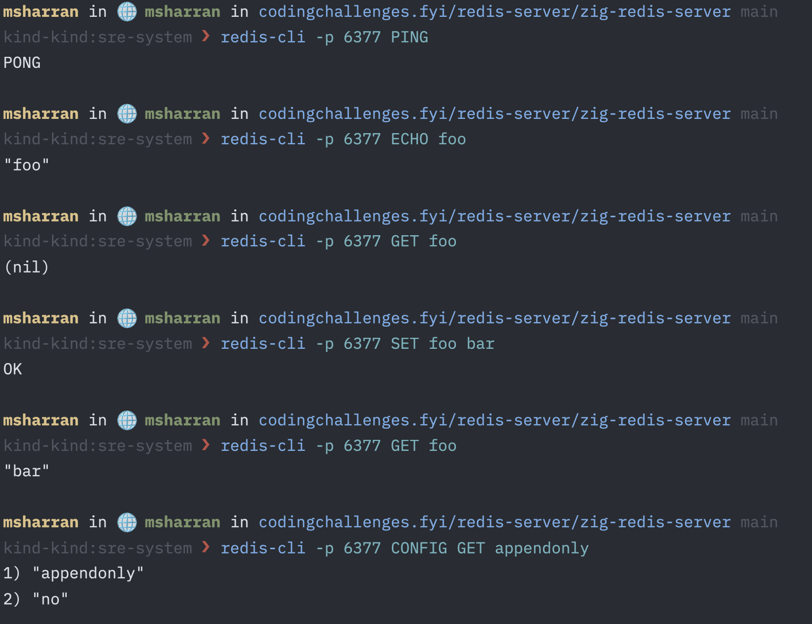

# Redis Server

# Features

- RESP Protocol Serialisation and Deserialisation (Simple String, Bulk String, Integer, Error, Nil)
- Commands Supported: PING, ECHO, SET, GET
- Non Blocking IO for accepting connections: uses libxev
- ThreadPool strategy for handling connections concurrently in multiple threads

# Getting Started

## Start server

```sh
❯ zig build run
info(redis): Server initialised
info(server): Server listening on 127.0.0.1:6377
info(server): Client connected: 127.0.0.1:49803
debug(resp): Serialised: +PONG

info(server): Client connection closed: 127.0.0.1:49803
info(server): Client connected: 127.0.0.1:49823
debug(resp): Serialised: $12
Hello World!

info(server): Client connection closed: 127.0.0.1:49823
info(server): Client connected: 127.0.0.1:49841
debug(resp): Serialised: +OK

info(server): Client connection closed: 127.0.0.1:49841
```

## Connect to server using `redis-cli`

```sh
❯ redis-cli -p 6377 PING
PONG
❯ redis-cli -p 6377 ECHO "Hello World!"
"Hello World!"
❯ redis-cli -p 6377 GET foo
(nil)
❯ redis-cli -p 6377 SET foo bar
OK
❯ redis-cli -p 6377 GET foo
"bar"
```

## All supported commands



---

# References

- [TCP Server in Zig](https://www.openmymind.net/TCP-Server-In-Zig-Part-1-Single-Threaded/)
- [Redis Protocol](https://redis.io/docs/latest/develop/reference/protocol-spec/#resp-protocol-description)
- [Coding Challenge: Implement a Redis Server](https://codingchallenges.fyi/challenges/challenge-redis/)
